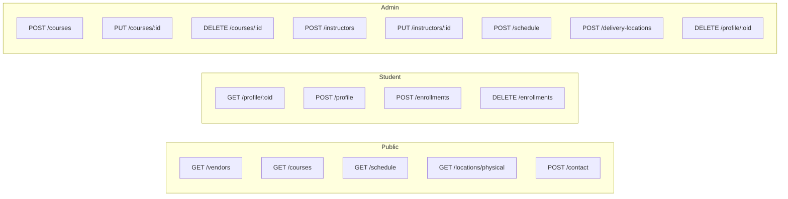
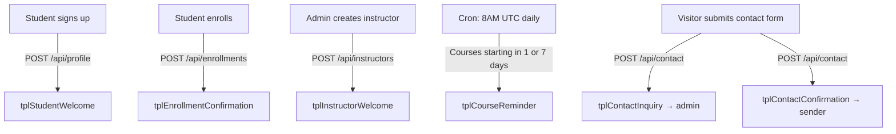

# API Reference

Base URL: `https://techbridge-dcadfwggdsckfebs.spaincentral-01.azurewebsites.net/api`

All endpoints accept and return JSON. No authentication middleware is enforced at the API level — access control is handled in the frontend.

Backend routes are modular — each resource has its own file in `server/routes/`. Services (`server/services/`) handle email and Entra ID integration. Email templates live in `server/templates/`.

## Endpoint Map



## Vendors — `server/routes/vendors.js`

### `GET /api/vendors`
Returns all certification vendors.

**Response:** `[{ id, name, color, logo }]`

---

## Courses — `server/routes/courses.js`

### `GET /api/courses`
Returns all courses with vendor, instructor, and location details joined.

**Response:**
```json
[{
  "id": 1, "vendor_id": "comptia", "code": "CompTIA A+",
  "title": "IT Fundamentals & Hardware", "level": "Beginner",
  "duration": "10 weeks", "price": 1200, "seats": 20, "enrolled": 14,
  "delivery": "Hybrid", "next_start": "2026-04-07",
  "description": "...", "badge": "Core",
  "vendor_name": "CompTIA", "vendor_color": "#e8320a", "vendor_logo": "...",
  "instructor_id": 1, "instructor_first_name": "Marcus", "instructor_last_name": "Williams",
  "loc_id": 1, "loc_name": "...", "loc_type": "Physical", "loc_timezone": "UTC"
}]
```

### `POST /api/courses`
Create a new course.

**Request:** `{ vendor_id, code, title, level, duration, price, seats, delivery, next_start, description, badge?, instructor_id?, delivery_location_id? }`

### `PUT /api/courses/:id`
Update an existing course.

### `DELETE /api/courses/:id`
Delete a course. Cascades to schedule and enrollments.

---

## Instructors — `server/routes/instructors.js`

### `GET /api/instructors`
Returns all instructors ordered by name.

### `POST /api/instructors`
Create an instructor. Auto-creates an Entra ID account in the tidisoft.com tenant and sends a welcome email with temporary credentials.

**Request:** `{ first_name, last_name, email, phone?, title?, bio?, specializations?, certifications?, employment_type, status, hire_date?, available_days?, available_hours? }`

**Response:** `{ ...instructor, upn, tempPassword, entraWarning? }`

### `PUT /api/instructors/:id`
Update an instructor. Creates Entra account if not already linked.

### `DELETE /api/instructors/:id`
Soft delete — sets status to "Inactive".

---

## Delivery Locations — `server/routes/locations.js`

### `GET /api/delivery-locations`
Returns all active delivery locations.

### `GET /api/locations/physical`
Public endpoint — returns only active physical locations (for contact page map).

### `POST /api/delivery-locations`
Create a new location.

**Request:** `{ name, type?, address_line1?, city?, state_province?, country_code?, country_name?, postal_code?, room_number?, floor?, building?, capacity?, platform?, meeting_url?, timezone?, contact_name?, contact_email?, contact_phone?, notes? }`

### `PUT /api/delivery-locations/:id`
Update a location (including is_active flag).

### `DELETE /api/delivery-locations/:id`
Soft delete — sets is_active to FALSE.

---

## Schedule — `server/routes/schedule.js`

### `GET /api/schedule`
Returns schedule entries with course code and title joined.

### `POST /api/schedule`
**Request:** `{ course_id, day, time, instructor, room, type }`

### `PUT /api/schedule/:id`
### `DELETE /api/schedule/:id`

---

## Students & Enrollments — `server/routes/students.js` + `server/routes/enrollments.js`

### `GET /api/students`
Returns students with enrollment count.

### `GET /api/students/:id/enrollments`
Returns a student's enrolled courses with course and vendor details.

### `GET /api/enrollments`
Admin view — all enrollments with student name, course code, vendor info.

### `POST /api/enrollments`
Enroll a student. Increments course enrolled count. Sends confirmation email.

**Request:** `{ student_id, course_id }`

### `DELETE /api/enrollments`
Unenroll a student. Decrements course enrolled count.

**Request:** `{ student_id, course_id }`

---

## Student Profiles — `server/routes/profiles.js`

### `GET /api/profiles`
Admin — list all student profiles.

### `GET /api/profile/:oid`
Get profile by Entra object ID.

### `POST /api/profile`
Create or update (upsert) a student profile. Sends welcome email on first creation. Updates Entra display name via Graph API.

**Request:** `{ entra_oid, first_name, last_name, email, country_code, country_name, city, phone?, date_of_birth?, education?, goals? }`

**Response:** `{ ...profile, is_new }`

### `DELETE /api/profile/:oid`
Delete profile and associated Entra user.

---

## Contact — `server/routes/contact.js`

### `POST /api/contact`
Submit a contact inquiry. Stores in DB, sends admin notification and sender confirmation emails.

**Request:** `{ name, email, phone?, subject, message }`

**Validation:** name, email, subject, message required. Subject must be: `General Inquiry | Enrollment | Partnership | Technical Support`

---

## Email Notifications — `server/services/email.js` + `server/templates/index.js`



| Template | Trigger | Recipient | Content |
|----------|---------|-----------|---------|
| tplStudentWelcome | New profile created | Student | Welcome, next steps |
| tplEnrollmentConfirmation | Enrollment | Student | Course details, start date |
| tplInstructorWelcome | Instructor created | Instructor | UPN + temp password |
| tplCourseReminder | Daily cron (8AM UTC) | Enrolled students | Course starts in 1 or 7 days |
| tplContactInquiry | Contact form | info@techbridge.edu | Inquiry details |
| tplContactConfirmation | Contact form | Sender | Acknowledgment |
