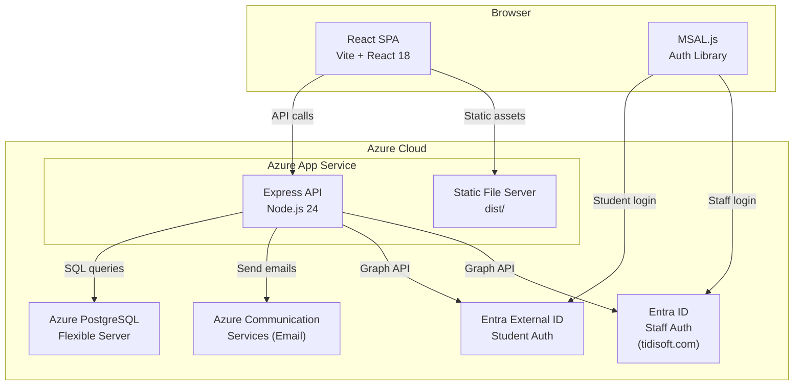
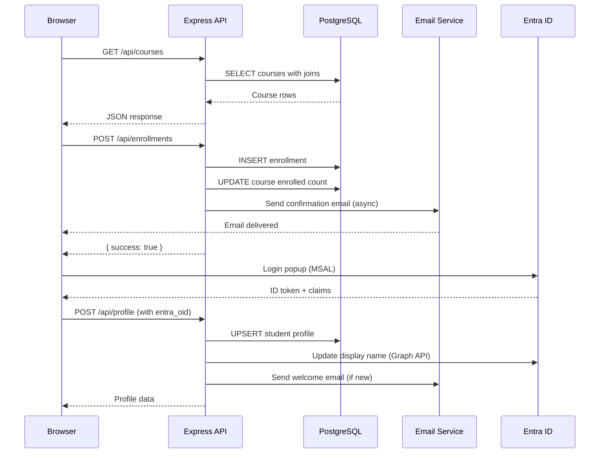

# Architecture Overview

TechBridge Institute is an IT vocational training platform built as a React SPA with an Express API backend, PostgreSQL database, and Azure cloud services.

## System Architecture



## Request Flow



## Tech Stack

| Layer | Technology | Purpose |
|-------|-----------|---------|
| Frontend | React 18 + Vite 7 | Modular SPA with React Router |
| Styling | Tailwind CSS v4 | Utility-first CSS (shared components) |
| Routing | React Router DOM | Client-side URL-based navigation |
| Backend | Express 5 (Node.js 24) | Modular REST API (routes/services/templates) |
| Database | PostgreSQL (pg) | Relational data store |
| Auth | MSAL.js + Entra ID | Student CIAM + Staff corporate |
| Email | Azure Communication Services | Transactional emails |
| CI/CD | GitHub Actions | Build, test, deploy |
| Hosting | Azure App Service | Production + staging slots |
| Domain | techbridge.academy | GoDaddy DNS → Azure |

## Project Structure

```
src/
  api/client.js              # Centralized API client with namespaced methods
  auth/msalConfig.js         # MSAL config (student CIAM + staff corporate)
  components/                # Shared UI components (Tailwind CSS)
    AuthWall.jsx             # Auth gate with sign-in prompt
    Badge.jsx                # Course badge (Hot/New/Core)
    Chip.jsx                 # Colored tag chip
    CourseCard.jsx            # Course catalog card
    SignInSelector.jsx        # 3-card sign-in modal
  utils/
    constants.js             # INTEGRATIONS, levelColor, TIMEZONES, empty form defaults
    normalizers.js           # normalizeCourse(), normalizeSchedule()
  views/                     # One file per route/view
    HomeView.jsx             # Hero, vendors, integrations
    CoursesView.jsx          # Filterable course catalog
    ScheduleView.jsx         # Class schedule table
    ContactView.jsx          # Contact form + Google Maps
    RegisterView.jsx         # 3-step enrollment wizard
    DashboardView.jsx        # Student progress + certificates
    EducatorPortalView.jsx   # Instructor portal (4 tabs)
    AdminView.jsx            # Full CRUD admin console (8 tabs)
    ProfileSetupView.jsx     # First-time profile gate
    ProfileEditView.jsx      # Edit existing profile
  App.jsx                    # Routing shell (~220 lines)
  main.jsx                   # BrowserRouter + MsalProvider + CSS import
  index.css                  # Tailwind base + custom dark theme

server/
  routes/                    # Express route modules
    vendors.js, courses.js, instructors.js, locations.js,
    schedule.js, students.js, enrollments.js, profiles.js, contact.js
  services/
    email.js                 # sendEmail + template re-exports
    entra.js                 # Graph API helpers (student + staff tenants)
  templates/
    index.js                 # emailWrapper + 6 email template functions
  db.js                      # PostgreSQL pool
  index.js                   # Express entry point (~85 lines)
```

## Key Design Decisions

- **Modular SPA**: Views, components, and utilities in separate files — clear ownership and easy navigation
- **React Router**: URL-based navigation (`/courses`, `/admin`, etc.) with browser history support
- **Tailwind CSS v4**: Shared components use Tailwind; view files retain inline styles for incremental migration
- **Modular backend**: Routes, services, and templates separated — each route file owns its endpoints
- **Dual auth tenants**: Student CIAM (Entra External ID) separate from staff corporate (tidisoft.com Entra ID)
- **Fire-and-forget emails**: Email sends are async and don't block API responses
- **Soft deletes**: Instructors and locations use status/is_active flags instead of hard deletes
