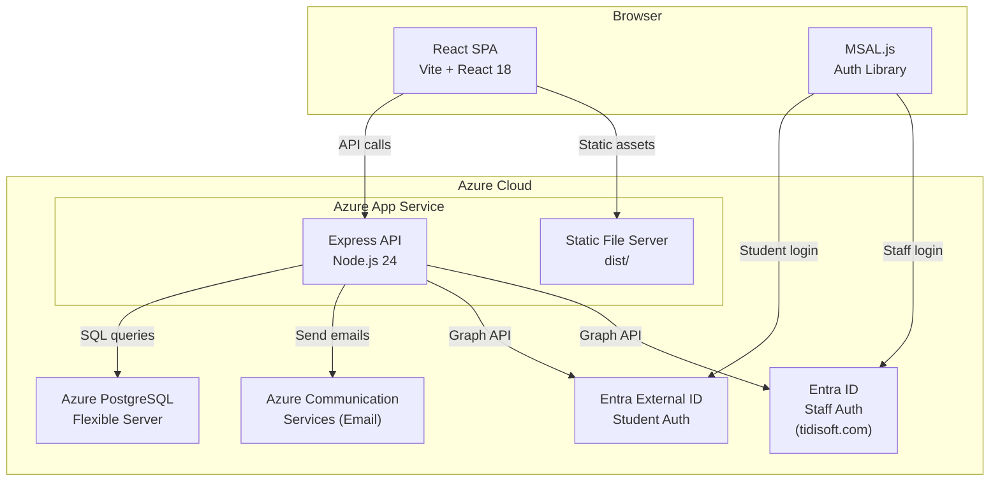
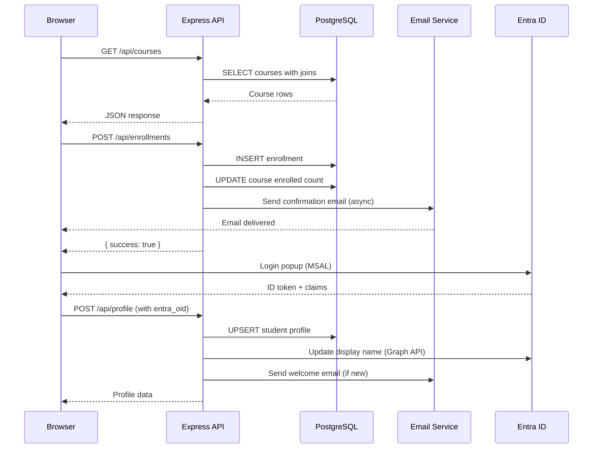

# Architecture Overview

TechBridge Institute is an IT vocational training platform built as a React SPA with an Express API backend, PostgreSQL database, and Azure cloud services.

## System Architecture

## Request Flow

## Tech Stack

| Layer | Technology | Purpose |
|-------|-----------|---------|
| Frontend | React 18 + Vite 7 | SPA with inline styles |
| Backend | Express 5 (Node.js 24) | REST API |
| Database | PostgreSQL (pg) | Relational data store |
| Auth | MSAL.js + Entra ID | Student CIAM + Staff corporate |
| Email | Azure Communication Services | Transactional emails |
| CI/CD | GitHub Actions | Build, test, deploy |
| Hosting | Azure App Service | Production + staging slots |
| Domain | techbridge.academy | GoDaddy DNS → Azure |

## Key Design Decisions

- **Monolithic SPA**: All views in a single `App.jsx` — simple to deploy, trades off code organization
- **No routing library**: Client-side navigation via `useState("view")` — lightweight, no URL sync
- **Inline styles**: No CSS framework — consistent dark theme, but harder to maintain at scale
- **Dual auth tenants**: Student CIAM (Entra External ID) separate from staff corporate (tidisoft.com Entra ID)
- **Fire-and-forget emails**: Email sends are async and don't block API responses
- **Soft deletes**: Instructors and locations use status/is_active flags instead of hard deletes
