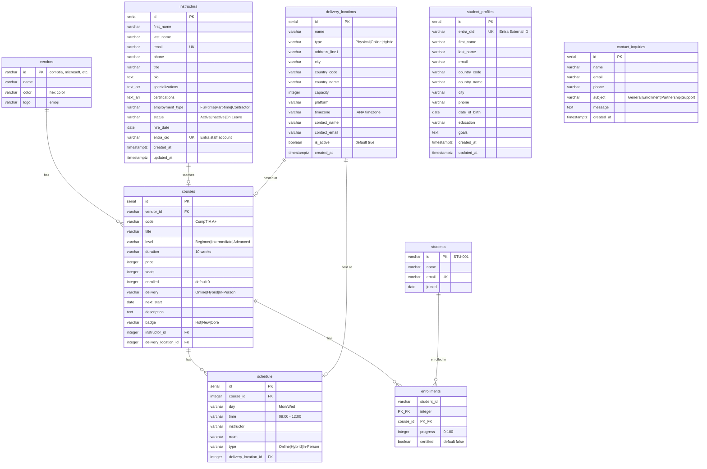

# Database Schema

PostgreSQL hosted on Azure. Connection via `DATABASE_URL` environment variable with SSL enabled.

## Entity Relationship Diagram

## Tables Summary

| Table | Records | Purpose |
|-------|---------|---------|
| vendors | 5 | CompTIA, Microsoft, Fortinet, Ubiquiti, Cisco |
| courses | 11 | IT certification courses |
| schedule | 6 | Class schedule entries |
| students | 3 | Legacy student records |
| enrollments | 5 | Student-course enrollments with progress |
| instructors | dynamic | Teaching staff with Entra accounts |
| delivery_locations | dynamic | Physical/online training venues |
| student_profiles | dynamic | Entra-linked student profiles |
| contact_inquiries | dynamic | Contact form submissions |

## Migrations

Run migrations via: `node scripts/run_migration.mjs scripts/<filename>.sql`

| File | Table | Notes |
|------|-------|-------|
| techbridgedatasql.sql | vendors, courses, schedule, students, enrollments | Main schema + seed data |
| add_instructors.sql | instructors | With indexes and updated_at trigger |
| add_delivery_locations.sql | delivery_locations | With indexes and updated_at trigger |
| add_instructor_to_courses.sql | courses | Adds instructor_id and delivery_location_id columns |
| add_student_profiles.sql | student_profiles | Entra-linked profiles |
| add_contact_inquiries.sql | contact_inquiries | Contact form storage |

## Indexes

- `idx_instructors_status` on instructors(status)
- `idx_delivery_locations_country` on delivery_locations(country_code)
- `idx_delivery_locations_active` on delivery_locations(is_active)
