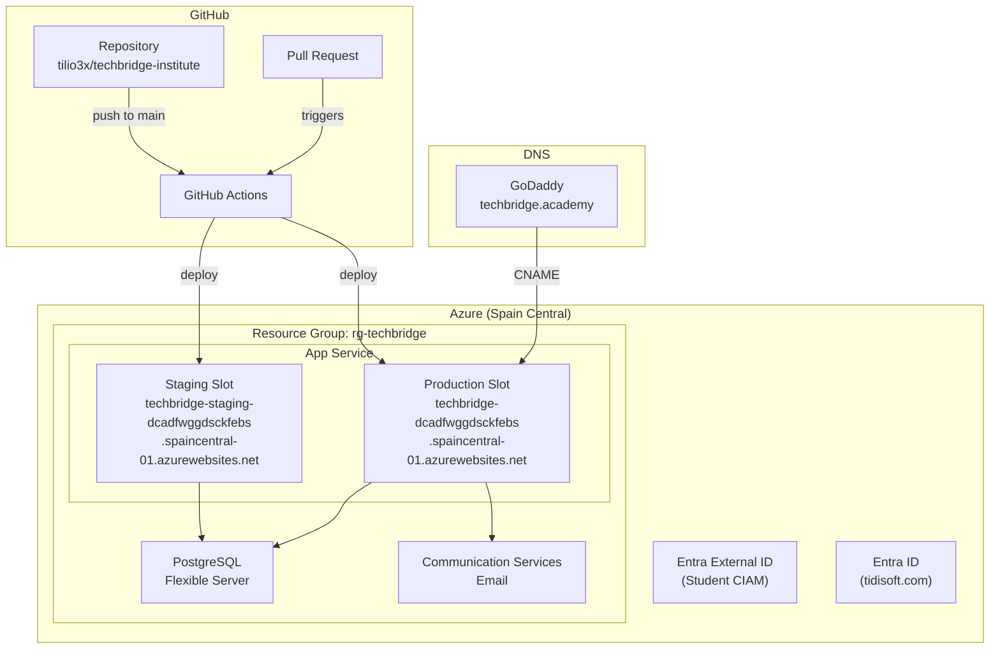
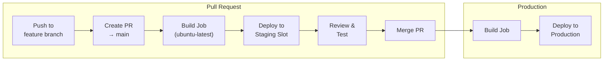

# Deployment & Infrastructure

## Infrastructure Diagram



## CI/CD Pipeline



### Build Job

1. Checkout repository
2. Setup Node.js 24.x with npm cache
3. `npm ci` (install dependencies)
4. `npm run build` (Vite build with VITE_* env vars)
5. Package `dist/` + `server/` + `package.json` + `package-lock.json`
6. Upload build artifact (1-day retention)

### Deploy Job (Staging or Production)

1. Download build artifact
2. Setup Node.js 24.x
3. `npm install --omit=dev` (production deps only)
4. Azure CLI login with service principal
5. Configure App Service settings (DATABASE_URL, ACS_*, NODE_ENV)
6. Deploy with `az webapp deploy --type zip`
7. Set startup command: `node server/index.js`

## Environment Variables

### Frontend (build-time, VITE_* prefix)

| Variable | Purpose |
|----------|---------|
| VITE_ENTRA_CLIENT_ID | Student CIAM application ID |
| VITE_ENTRA_TENANT_SUBDOMAIN | Student CIAM subdomain |
| VITE_ENTRA_STAFF_TENANT_ID | Staff (tidisoft.com) tenant ID |
| VITE_ENTRA_STAFF_CLIENT_ID | Staff application ID |

### Backend (runtime)

| Variable | Purpose |
|----------|---------|
| DATABASE_URL | PostgreSQL connection string |
| NODE_ENV | production |
| PORT | Server port (default: 3001) |
| ACS_CONNECTION_STRING | Azure Communication Services endpoint |
| ACS_SENDER_EMAIL | Sender address (noreply@techbridge.academy) |
| ENTRA_TENANT_ID | Student CIAM tenant for Graph API |
| ENTRA_CLIENT_ID | Backend app registration (student tenant) |
| ENTRA_CLIENT_SECRET | Backend app secret (student tenant) |
| ENTRA_STAFF_TENANT_ID | Staff tenant for Graph API |
| ENTRA_STAFF_CLIENT_ID | Backend app registration (staff tenant) |
| ENTRA_STAFF_CLIENT_SECRET | Backend app secret (staff tenant) |

## Branching Strategy

```mermaid
gitgraph
    commit id: "main (production)"
    branch feature/new-feature
    commit id: "work"
    commit id: "more work"
    checkout main
    merge feature/new-feature id: "PR merge → deploy"
    commit id: "hotfix"
```

| Branch Pattern | Purpose | Target |
|---------------|---------|--------|
| `feature/*` | New features | PR → main |
| `bugfix/*` | Bug fixes | PR → main |
| `hotfix/*` | Critical production fixes | PR → main |
| `chore/*` | Non-functional changes | PR → main |

### Branch Protection (main)

- Require PR before merging
- Require "Build React App" status check to pass
- No direct pushes allowed

## App Service Configuration

| Setting | Value |
|---------|-------|
| Runtime | Node.js 24 LTS |
| Region | Spain Central |
| Startup | `node server/index.js` |
| Port | 3001 (Express serves API + static dist/) |
| SSL | App Service managed certificate |
| Custom Domain | techbridge.academy |

## Database

- **Service:** Azure Database for PostgreSQL — Flexible Server
- **SSL:** Required (`rejectUnauthorized: false` in pg Pool)
- **Migrations:** Manual via `node scripts/run_migration.mjs scripts/<file>.sql`
