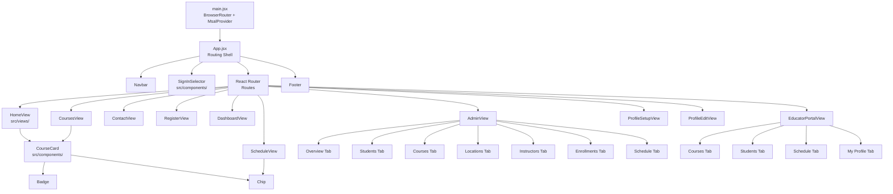
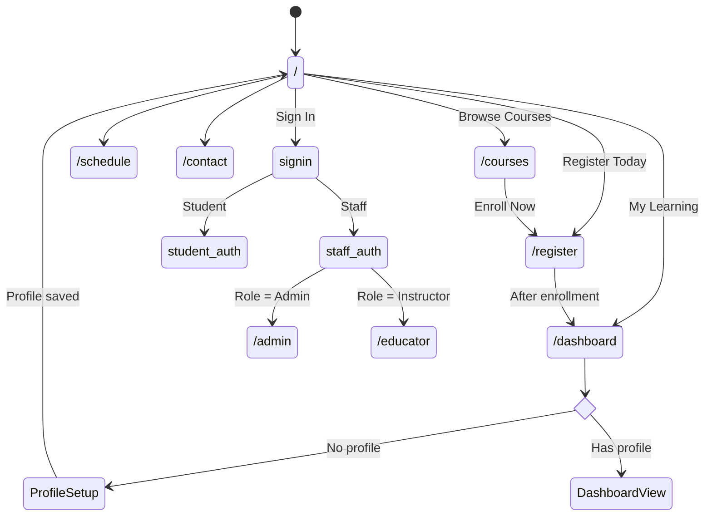

# Frontend Architecture

Modular React SPA built with Vite, React Router, and Tailwind CSS v4. Views are split into individual files under `src/views/`, shared components under `src/components/`, and utilities under `src/utils/`.

## File Structure

```
src/
  App.jsx                    # Routing shell — navbar, routes, footer (~220 lines)
  main.jsx                   # BrowserRouter + MsalProvider + CSS import
  index.css                  # Tailwind CSS base + custom dark theme (@theme)
  api/client.js              # Centralized fetch wrapper with namespaced methods
  auth/msalConfig.js         # Dual MSAL configs (student CIAM + staff corporate)
  components/                # Shared UI (Tailwind CSS classes)
  utils/                     # Constants, normalizers
  views/                     # One file per route (10 views)
```

## Component Tree



## Routing

React Router DOM provides URL-based navigation. Routes are defined in `App.jsx`:

| Path | View | Auth | Role | Purpose |
|------|------|------|------|---------|
| `/` | HomeView | No | — | Hero, vendor showcase, stats, integrations |
| `/courses` | CoursesView | No | — | Catalog landing with provider cards |
| `/courses/:vendorId` | VendorCoursesView | No | — | Paginated vendor course listing with filters |
| `/courses/:vendorId/:courseId` | CourseDetailView | No | — | Course detail: stats bar, skills, syllabus, details table |
| `/schedule` | ScheduleView | No | — | Class schedule table |
| `/contact` | ContactView | No | — | Contact form + Google Maps |
| `/register` | RegisterView | Yes | Student | 3-step enrollment wizard |
| `/dashboard` | DashboardView | Yes | Student | Progress, certificates, quick links |
| `/educator` | EducatorPortalView | Yes | Instructor | Instructor's courses, students, schedule, profile |
| `/admin` | AdminView | Yes | Admin | Full CRUD admin console |
| `/profile` | ProfileEditView | Yes | Student | Edit existing profile |
| `*` | HomeView | No | — | Catch-all fallback |

Protected routes show `AuthWall` if the user isn't authenticated or lacks the required role.

## Navigation Flow



## Authentication Flow


## State Management

All state lives in `App.jsx` via `useState` and is passed as props to views:

| State | Type | Source | Used by |
|-------|------|--------|---------|
| vendors | array | GET /api/vendors | HomeView, CoursesView, AdminView, Footer |
| courses | array | GET /api/courses | Most views |
| schedule | array | GET /api/schedule | ScheduleView, AdminView, EducatorPortal |
| students | array | GET /api/students | AdminView |
| profiles | array | GET /api/profiles | AdminView |
| instructors | array | GET /api/instructors | AdminView, EducatorPortal |
| deliveryLocations | array | GET /api/delivery-locations | AdminView, ContactView |
| enrollments | array | GET /api/enrollments | AdminView, EducatorPortal |
| enrolledCourses | array | Local state | CoursesView, RegisterView, DashboardView |
| profile | object | GET /api/profile/:oid | DashboardView, ProfileEditView |
| loading | boolean | — | Loading screen |

## Shared Components

Located in `src/components/`, styled with Tailwind CSS:

| Component | File | Props | Purpose |
|-----------|------|-------|---------|
| AuthWall | AuthWall.jsx | onLogin, message | Auth gate with sign-in button |
| Badge | Badge.jsx | text | Course badge (Hot/New/Core) with color mapping |
| Chip | Chip.jsx | text, color | Colored tag with dynamic background |
| CourseCard | CourseCard.jsx | course, onEnroll, isEnrolled | Course catalog card |
| SignInSelector | SignInSelector.jsx | onStudentLogin, onStaffLogin, onClose | 3-card sign-in modal |

## API Client

`src/api/client.js` provides a centralized fetch wrapper:

```js
import { api } from "../api/client";

// Namespaced methods
api.vendors.list()
api.courses.create(data)
api.courses.update(id, data)
api.courses.remove(id)
api.profiles.get(oid)
api.profiles.save(data)
api.contact.submit(data)
```

## Design System

- **Theme:** Dark (`#0a0f1e` background, `#f1f5f9` text)
- **Primary gradient:** `linear-gradient(135deg, #0ea5e9, #6366f1)` (sky → indigo)
- **Success:** `#22c55e` | **Warning:** `#ef4444` | **Info:** `#0ea5e9`
- **Font:** Segoe UI, system-ui, sans-serif
- **Styling:** Tailwind CSS v4 (shared components) + inline styles (views, incremental migration)
- **Tailwind config:** Via `@theme` directive in `src/index.css` (no `tailwind.config.js`)
- **Custom colors:** `dark-bg`, `dark-card`, `dark-surface`, `dark-border`
