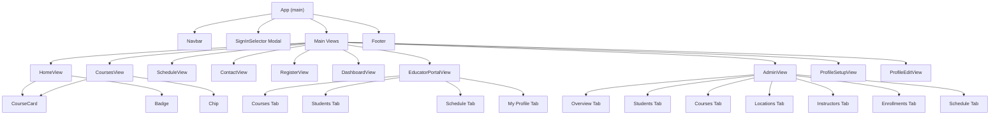
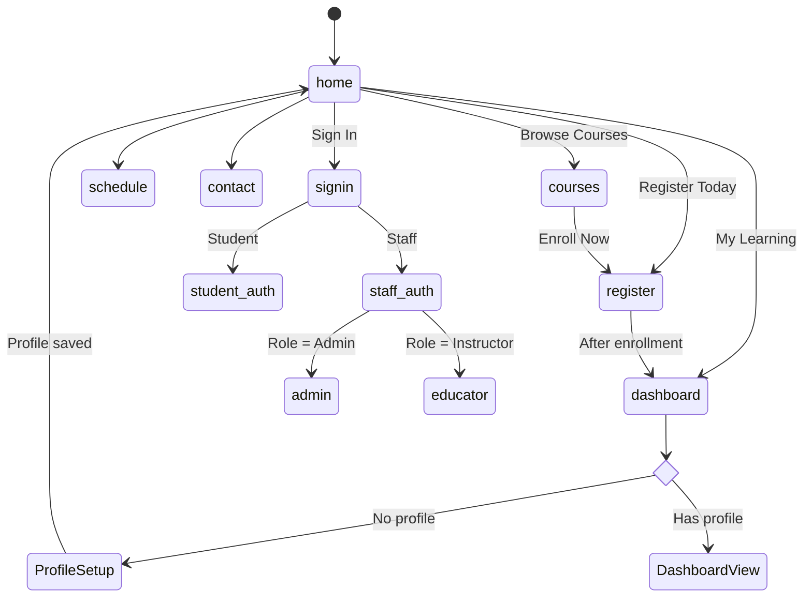
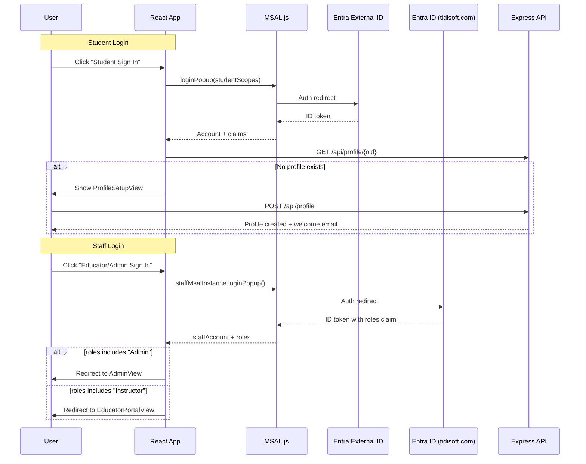

# Frontend Architecture

Single-page React application built with Vite. All components live in `src/App.jsx` (3165 lines). No routing library — navigation managed via `useState`.

## Component Tree

## Navigation Flow

## Views

| View | Nav Label | Auth Required | Role | Purpose |
|------|-----------|---------------|------|---------|
| HomeView | Home | No | — | Hero, vendor showcase, stats, integrations |
| CoursesView | Courses | No | — | Filterable course catalog |
| ScheduleView | Schedule | No | — | Class schedule table |
| ContactView | Contact | No | — | Contact form + Google Maps |
| RegisterView | Register | Yes | Student | 3-step enrollment wizard |
| DashboardView | My Learning | Yes | Student | Progress, certificates, quick links |
| EducatorPortalView | My Portal | Yes | Instructor | Instructor's courses, students, schedule, profile |
| AdminView | Admin | Yes | Admin | Full CRUD admin console |
| ProfileSetupView | — | Yes | Student | First-time profile creation (gate) |
| ProfileEditView | — | Yes | Student | Edit existing profile |

## Authentication Flow

## State Management

All state lives in the main `App` component via `useState`:

| State | Type | Source | Used by |
|-------|------|--------|---------|
| view | string | User navigation | All (conditional rendering) |
| vendors | array | GET /api/vendors | CoursesView, AdminView |
| courses | array | GET /api/courses | Most views |
| schedule | array | GET /api/schedule | ScheduleView, AdminView, EducatorPortal |
| students | array | GET /api/students | AdminView |
| profiles | array | GET /api/profiles | AdminView |
| instructors | array | GET /api/instructors | AdminView, EducatorPortal |
| deliveryLocations | array | GET /api/delivery-locations | AdminView, ContactView |
| enrollments | array | GET /api/enrollments | AdminView, EducatorPortal |
| enrolledCourses | array | Local state | CoursesView, RegisterView, DashboardView |
| profile | object | GET /api/profile/:oid | DashboardView, ProfileEditView |
| loading | boolean | — | Loading screen |

## Design System

- **Theme:** Dark (`#0a0f1e` background, `#f1f5f9` text)
- **Primary gradient:** `linear-gradient(135deg, #0ea5e9, #6366f1)` (cyan → indigo)
- **Success:** `#22c55e` | **Warning:** `#ef4444` | **Info:** `#0ea5e9`
- **Font:** Segoe UI, system-ui, sans-serif
- **Styling:** Inline JSX styles (no CSS files or framework)
